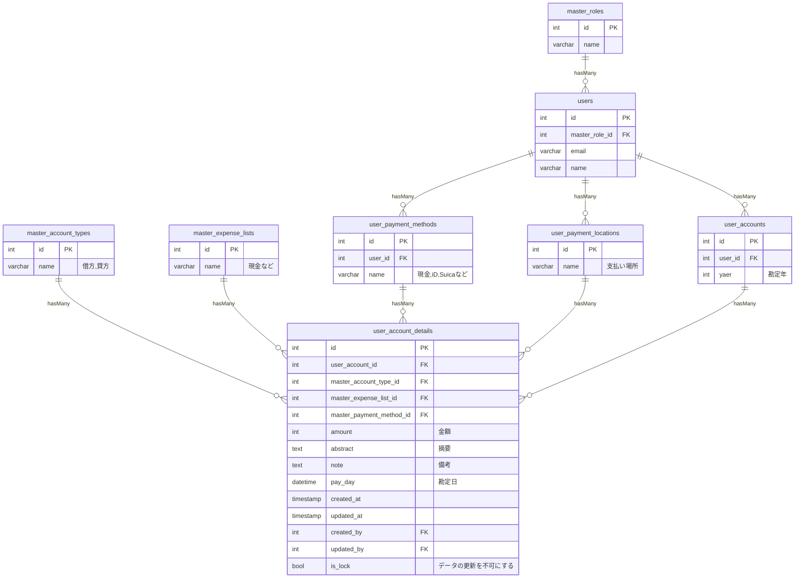

### 2024/02/23

- RBAC システムで権限周りは制御する

---

```mermaid
erDiagram

master_roles {
    int id PK
    varchar name
}
master_roles ||--o{ users : hasMany

master_account_types {
    int id PK
    varchar name "借方,貸方"
}
master_account_types ||--o{ user_account_details : hasMany

master_expense_lists {
    int id PK
    varchar name "現金など"
}
master_expense_lists ||--o{ user_account_details : hasMany

user_payment_methods {
    int id PK
    int user_id FK
    varchar name "現金,iD,Suicaなど"
}
user_payment_methods ||--o{ user_account_details : hasMany

user_payment_locations {
    int id PK
    varchar name "支払い場所"
}
user_payment_locations ||--o{ user_account_details : hasMany

users {
    int id PK
    int master_role_id FK
    varchar email
    varchar name
}
users ||--o{ user_accounts : hasMany
users ||--o{ user_payment_methods : hasMany
users ||--o{ user_payment_locations : hasMany

user_accounts {
    int id PK
    int user_id FK
    int yaer "勘定年"
}
user_accounts ||--o{ user_account_details : hasMany

user_account_details {
    int id PK
    int user_account_id FK
    int master_account_type_id FK
    int master_expense_list_id FK
    int master_payment_method_id FK
    int amount "金額"
    text abstract "摘要"
    text note "備考"
    datetime pay_day "勘定日"
    timestamp created_at
    timestamp updated_at
    int created_by FK
    int updated_by FK
    bool is_lock "データの更新を不可にする"
}
```
